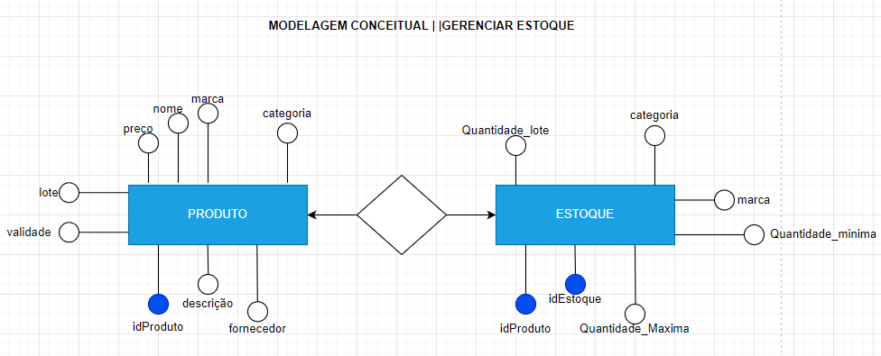
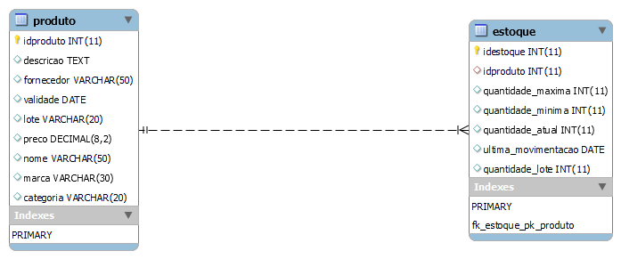

# Estudo de caso
## Casa Oliveira

Roberto é dono de um mercado no bairro de Vargem Grande, na cidade de Tupã. Ele herdou o negócio de seu pai, Gumercindo Oliveira, ela foi aberta em 1978 na garagem da casa da família, era uma pequena quitanda. Com o passar dos anos o negócio cresceu e Gumercindo foi obrigado a ir para outro ponto maior e ali permaneceu até os dias atuais.

Roberto, que agora é o novo dono do mercado continuou o negócio seguindo da mesma forma que o pai. Ele comprava diretamente com os fornecedores grandes volumes de produtos e armazenava em seu estoque. As vezes ele comprava muitos produtos que ainda havia em estoque causando uma sobrecarga de produtos, ele também tinha muitos produtos estragados, tais como: frutas, legumes, iogurtes, leites, frango etc. Também havia muitos produtos com o prazo de validade vencido.

Os funcionários eram poucos e faziam muitas coisas ao mesmo tempo. O açougueiro também ajudava no estoque, a moça da limpeza ajudava na organização dos produtos das prateleiras, além de ajudar na padaria, quanto o caixa estava vazio o operador ajudava a repor os laticínios e a limpar a loja. O repositor também fazia operação no caixa.

Ao realizar a venda o Roberto, que sabia o nome de quase todos os clientes, anotava em um caderno todos os produtos que vendia e que havia em estoque. Ao fim do dia , Roberto pegava o caderno de fazia os cálculos de o quanto havia vendido, somando o faturamento e realizando a atualização do estoque. Isso é feito todos os dias e toma um tempo considerável para que tudo tenha sido feito.

Roberto fechava a loja as 18h, mas só ia para casa as 22h, após fazer todas as operações necessárias. Mesmo assim o negócio vai bem e Roberto pretende ir para outro ponto e aumentar o volume de negócios e contratar novos funcionários.

Marica, esposa de Roberto, vem conversando com ele há muito tempo para que ele contrate uma empresa para construir um sistema de informática para gerenciar o negócio e reduzir o tempo que ele passa trabalhando e tenha maior organização dos produtos, maior lucratividade e melhorar a gestão.

Com a intenção de aumentar o negócio, Roberto está disposto a informatizar sua empresa. Vamos ajudá-lo. Iremos começar construindo o banco de dados. 

### Problemas a serem solucionados:
1 – Gerenciamento de Estoque;

2 – Falta de Funcionários;

3 – Designação de funções;

4 – Fluxo de caixa: entrada e saída de valores;

5 – Baixa no estoque;

6 – Patrimônio: computadores, prateleiras, freezers,
 geladeiras, caixas, carrinhos, balcões, balanças etc...;
7 – Setor de compras; e

8 – Setor financeiros.


1: Gestão de estoque.
a.	Informações sobre os produtos: nome/descrição/marca, idProduto, valor, lote, validade, categoria e fornecedor.

b.	Volume de produtos em estoque: quantidade atual/max/min, quantidade por lote, última movimentação.

2: Funcionário.
a.	Nome, função|carga, salário, matrícula, cpf, rg, telefone, e-mail, estado civil, admissão, data_nascimento, endereço, usuário|senha, idFuncionário.

3: Fluxo de caixa.
a.	Forma_pagamento, limite_sangria, valor, entrada|saída, registro_venda, 

4: Gestão de patrimônio.
a.	idPatrimonio, cod.Patrimonio, descrição, valor, nome, setor, data_aquisição, setor_responsavel, data_baixa.

5: Setor de compras.
a.	idCompra, funcionário, valor_pago, fornecedor, data_compra, nota_fiscalnome_produto, descrição, quantidade, setor_destino.

6: Setor Financeiro
	a.   idFinanceiro, despesas, lucro, disponibilidade_cofre, valor, tipo_valor, data_operação, identificação_responsavel.

### MODELO CONCEITUAL


### Modelo lógico


---
### Modelo físico

#### Código e documentação do modelo físico
```
/*
Para o projeto de banco de dados da Casa Oliveira será criado 
uma estrutura física com os comandos SQL(Structure Query Language)
Iremos começar com o comando de criação de banco de dados. Este 
comando pertence a categoria de comandos DDL(Data Definition Language)
Comando:
	CREATE DATABASE nome_do_banco -> CREATE DATABASE casaoliveira
*/

CREATE DATABASE casaoliveira;
/*
Após a criação do banco de dados, é necessário selecioná-lo. Para isso
iremos usar o comando USE nome_do_bancodedados
*/
USE casaoliveira;

/*
Criação das entidades em modo físico usando os comandos SQL.
Para criar uma tabela(entidade) usaremos o comando 
CREATE TABLE nome_da_tabela seguido por parenteses e os 
atritubos(campos) da tabela, bem como a sua tipificação, ou seja,
devemos dizer qual o tipo de dados que cada campo(atributo) da 
tabela deve receber. Ex.: o campo idade deve receber valores 
numéricos e, portanto será definido como int(inteiro).

Vamos criar a tabela de produtos. Esta tabela possui os seguintes campos:
	- idproduto, descricao, fornecedor,validade, lote, preco, nome,marca, categoria
```
```
    Para cada será definido um tipo de dado
    para o idproduto, iremos definir como:
		- Chave-Primária (Primary Key) é nosso campo indexador, por ele será
        realizado o relacionamento com outras tabelas;
        - Vamos definir este campo com auto_incremente, o que permite gerar 
        os ids de forma automática. Esse passo é importe, pois elemina algums problemas,
         tais como: Concorrência, geração incrementada de valores e exclusividade
          de valores;
		- Vamos definir o campo o tipo de dado numérico int(inteiro)
```
```
        
 Para o campo descricao, usaremos o tipo de dado Text. Com este tipo podemos inserir 
 até 64mil caracteres. Como neste campo pode haver a possibilidade de uma descrição 
 longa do produto, se faz necessário uma tamanho maior. 
```
```
 
 Para o campo fornecedor iremos usar o tipo de dado VARCHAR. Este tipo de dados nos permite
 inserir textos, mas com um limite que pode ser pre definido pelo usuário ou podemos utilizar
 o limite total de 255 caractes. Para o fornecedor, usaremos 50 caracteres.
```
```
 Para o campo validade iremos usar o tipo de dado DATE.
```
```
 Para o campo lote será definido o tipo de dado VARCHAR, pois há a possibilidade de valor conter
 caracteres alfadecimais. Sendo assim, o VARCHAR é uma ótima opção por aceitar valores diversos.
```
```
 O campo preco será definido como DECIMAL. Com esse tipo é possível inserir valores númericos
 com a aplicação de casas decimais. Você define o comprimento e deste tamanho é configurado as 
 casas decimais.Ex.: DECIMAL(10,2) -> COMPRIMEITO DE 10 DIGITOS E DESTES TEMOS 2 CASAS DECIMAIS.
 VEJA:	R$ 11111111,11  ->  R$ 11.111.111,11 -> R$ 35.665.235,23
```
```
 Para os campos nome, marca e categoria será definido o tipo de dado VARCHAR, pois este tipo 
 é capaz de receber caracteres de texto. Presaremos, apenas definir, o tamanho de cada campo.
 Ex.: nome pode ficar com o tamanho 50, marca ficar com 30 e categoria 20
```
 
 */
```
 CREATE TABLE produto(
 idproduto int auto_increment primary key,
 descricao text,
 fornecedor varchar(50),
 validade date,
 lote varchar(20),
 preco decimal(8,2),
 nome varchar(50),
 marca varchar(30),
 categoria varchar(20)
 );
```
```
 CREATE TABLE estoque(
 idestoque int auto_increment primary key,
 idproduto int,
 quantidade_maxima int,
 quantidade_minima int,
 quantidade_atual int,
 ultima_movimentacao date,
 quantidade_lote int);
```
```
ALTER TABLE `casaoliveira`.`estoque` 
ADD CONSTRAINT `fk_estoque_pk_produto`
FOREIGN KEY (`idproduto`)
REFERENCES `casaoliveira`.`produto` (`idproduto`)
```


### Modelo físico - MER (Modelo de Entidade Relacional)

